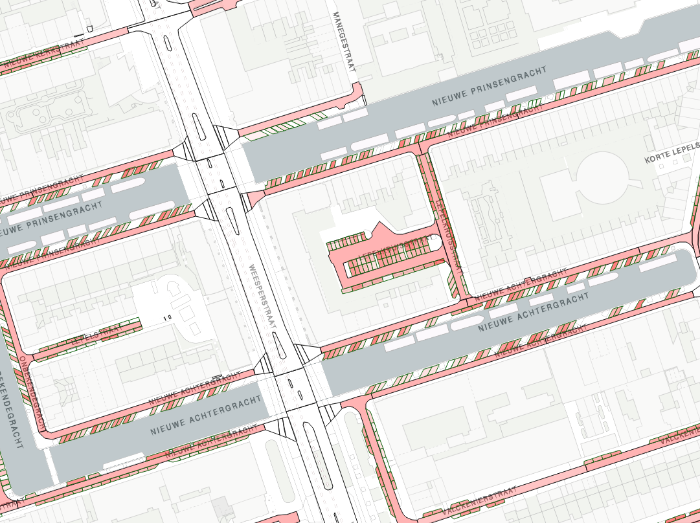

# kibana-plugin-parkeren

This is a custom kibana plugin we build to get more insight into the license plate scans of parked cars.
In dutch parking a car is called: parkeren hence the name.

The scans are made by  scan cars driving through the city in 2016. We have about 31.5 milion scans and more to come!

We annotaded the scan data with exact parking spots and road segments. This allows us to create aggregations about
the scan data in elasticsearch.

In order to make a nice map interface with kibana we combine the aggregations from elastic with the road and segment geometric
data. the 'enhanced_tilemap' plugin was very usefull but we wanted more specific insights.

At datapunt we created two 'WFS' services. One for parkingspots and another for road segments. These wfs services provide
us (given the map bounding box) all relavant parking spots and road segments.
Together with a bounding box aggregation from elasticsearch / kibana we can make a nice interactive map.

To create the visualization we use a leaflet map in which we combine the WFS data with
the aggregation data to create a nice map view and analyze the scan data.

